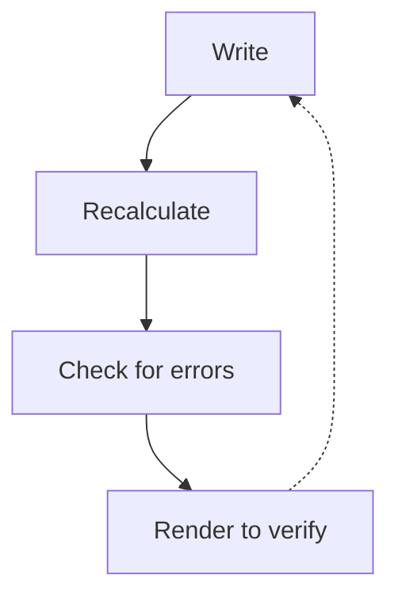

autoscale: true
slidenumbers: true
time-budget: 20
theme: Trust 1A

# Teaching Machines to Read Spreadsheets

### Nuno Campos — Witan Labs

#### AI Engineering London — April 2026

^ Duration: 20 minutes. Slides + code examples.

---

## 50% -> 92%

- 4 months, 4 codebases, 29,000 lines of eval infrastructure
- What mattered most: replacing 15 discrete tools with one REPL

^ This is about building an agent that reads and modifies Excel spreadsheets. We started at 50% accuracy on a financial analysis benchmark and got to 92%. The talk covers what actually moved the needle and what didn't. The short version: we kept building more tools, and the agent kept wanting to program. Once we let it, the results followed.

---

## The problem


**A human sees:** revenue table, assumptions, P&L summary

**An LLM sees:** 10,000 cell values, `=SUMPRODUCT((B$3:B$50="NEW")*(G$3:G$50))`, formatting metadata

^ Spreadsheets are deceptively hard for AI. A human glances at a financial model and instantly sees structure -- there's a revenue table here, assumptions in that yellow corner, a chart summarizing the P&L. They know "Q4" means the fourth column, parentheses mean negative numbers, the cell labeled "EBITDA" is derived from the ones above it.

^ An LLM sees none of this. Give it a 20-sheet financial model and ask "what's the IRR?" and it has to figure out not just what IRR means, but which of 10,000 cells contains the answer, which sheet it's on, and whether that number is an input or a calculated output.

---

## Attempt 1: Turn the spreadsheet into a database

- Excel -> SQLite (every cell, formula, merged region, color block)
- Agent: LangGraph + GPT-5, tools for SQL query / write cell / insert row

**Result: 50%**

^ Our first instinct: transform the problem. LLMs are good at SQL, so we built a pipeline that converts entire workbooks into SQLite databases. The agent had a handful of tools -- run a SQL query, write to a cell, insert a row. Each tool call was a separate round-trip to the model.

^ Tested against SpreadsheetBench, 130 tasks. First result: 50% pass rate. Not great.

---

## The one-character bug

Fixed one character in the extraction pipeline.

**50% -> 73%**

The agent had _looked_ confused. Our instinct was to blame the model.
The actual problem: the agent was reasoning correctly over corrupted inputs.

^ A one-character bug in our extraction code -- a wrong function argument -- was silently corrupting data for a large fraction of tasks. Fixing that single character moved us from 50 to 73%. More than any prompt engineering we'd done.

^ The agent had looked confused -- giving wrong answers, failing to find data. We blamed the model. But it was reasoning correctly over bad inputs. This became a recurring pattern: agent failures that look like reasoning failures are frequently data pipeline bugs in disguise.

---

## Attempt 2: More structure, more agents

**Three specialized agents:**

1. Block discovery (low effort) — identifies workbook structure
2. Edit agent (high effort) — 5-step process: disambiguate, define end state, plan, execute, verify
3. Question agent (read-only) — answers questions

**Key finding:** "Define the end state before you touch a cell" was the most impactful prompt instruction

^ Next we split into three agents. The important one was the edit agent's five-step reasoning process: disambiguate the request, define the desired end state, plan the implementation, execute, verify. This changed the kind of errors we got. Without it, the agent made irreversible mistakes mid-execution. With it, most errors surfaced during planning, where they're cheap. This worked better than giving the agent better tools, more context, or a stronger model.

^ But the architecture was rigid. Discovery happened once. Three LLM calls per task was expensive. And we still had 15+ tools the agent was juggling.

---

## The dead ends

| Representation | Why it failed                               |
| -------------- | ------------------------------------------- |
| TSV views      | Lost formatting and structural context      |
| SQL views      | Flat tables didn't capture visual structure |
| HTML tables    | Too verbose, consumed too many tokens       |
| DOT graphs     | Useful for analysis, not for interaction    |
| XML/XSLT       | LLM struggled with the syntax               |

None of them captured enough of the workbook's structure to be useful for interaction.

^ We also pivoted to TypeScript and .NET for better Excel fidelity. Then spent two weeks trying every possible way to represent a workbook to the LLM. TSV, SQL, HTML, Graphviz, XML. Each captured some aspects and lost others.

^ We stopped looking for the right static representation and tried a different approach.

---

## November 23rd: The REPL

We replaced all 15 tools with a persistent Node.js REPL and a spreadsheet API.

```
Agent Loop --(JavaScript code)--> Node.js REPL --(JSON-RPC)--> .NET engine
                                      |                            |
                                  Variables persist          Workbook state
                                  across calls               persists
```

^ On November 23rd, we replaced all 15 tools with one: a persistent Node.js REPL with access to a spreadsheet API -- about 50 operations for reading, searching, tracing formulas, and writing. Instead of "read this cell", "search for this label", "write this value" as separate tools, the agent writes JavaScript. Variables persist across calls. 90-second timeout per execution, 5MB output limit, syntax rewriting to block filesystem and network access.

---

## Before vs. After

**Before** (10-15 tool calls):

```
Tool call 1: list_sheets()           -> ["Summary", "Data", "Inputs"]
Tool call 2: read_range("Summary!A1:D10") -> cell values
Tool call 3: find_cells("Revenue")   -> [matches]
Tool call 4: read_cell("Summary!C10") -> "$1,234,567"
...
```

**After** (1 tool call):

```javascript
const sheets = await xlsx.listSheets(wb);
const summary = await xlsx.readRangeTsv(wb, `${sheets[0].name}!A1:D10`);
const revenue = await xlsx.findCells(wb, "Revenue", { context: 1 });
console.log(sheets, summary, revenue);
```

^ Here's what changed concretely. Before: exploring a workbook took 10 to 15 tool calls. Each one is an LLM round-trip -- the model has to decide what to do, format the tool call, wait for a result, interpret it, decide the next step.

^ After: the same exploration in one call. Three operations, all results visible together. But it goes further than just batching.

---

## Why the REPL actually worked

**1. Composability** — multiple operations per call, results feed into each other

**2. State persistence** — variables survive across calls, build up understanding incrementally

**3. Flexible exploration:**

```javascript
let results = await xlsx.findCells(wb, "Net Revenue");
if (!results.length)
  results = await xlsx.findCells(wb, ["Total Revenue", "Net Sales", "Revenue"]);
```

**4. API evolution is trivial** — add a function, the agent picks it up immediately

^ Four reasons this worked beyond the obvious batching benefit. One: composability. Results of one operation feed into the next within the same call. Two: state persistence. The agent opens a workbook in call one, and the handle is still there in call two. It builds up understanding incrementally without re-querying. Three: flexible exploration. The agent can try something, check the result, and adapt -- in a single tool call. Conditionals, loops, error recovery. This is something discrete tools fundamentally can't do.

^ Four: API evolution. Adding a new capability means adding a function. traceToInputs and traceToOutputs, for example, came from months of formula analysis work in Rust -- but adding them to the agent's toolkit was just two new functions. No tool schema changes, no registration. Today the entire API surface ships as a single skill prompt, recently compressed from 61k to 34k characters to fit in agent context windows.

---

## Four hard rules

Embedded in the system prompt, each learned from a specific failure:

1. **"Zero new formula errors"**
   After every write, check for errors. If your edit broke a formula, fix it before moving on.

2. **"Change inputs, not outputs"**
   Don't overwrite formulas. Change the cells they depend on.

3. **"Use the engine, not JavaScript math"**
   Read calculated values from the formula engine. Never substitute your own arithmetic.

4. **"Always cite sheet + address"**
   Every answer must reference where the data came from. `Summary!C10`.

^ We encoded four hard rules in the system prompt.

^ "Zero new formula errors" -- the agent used to make edits that silently broke downstream formulas. Now it checks after every write.

^ "Change inputs, not outputs" -- the agent used to overwrite cells containing formulas with hard-coded values. This destroyed the workbook's logic. Now it only modifies input cells and lets formulas propagate.

^ "Use the engine, not JavaScript math" -- the agent used to calculate things in code instead of reading from the spreadsheet's formula engine. The spreadsheet's formulas are the source of truth, and the agent's arithmetic was sometimes wrong.

^ "Always cite sheet and address" -- every answer must be verifiable. This changed how the agent approached problems. It couldn't just say "revenue is $1.2 million." It had to show where that number came from.

---

## The results

| Date   | Pass rate | Tasks |
| ------ | --------- | ----- |
| Nov 30 | **74%**   | 104   |
| Dec 11 | **88%**   | 167   |
| Dec 14 | **92.1%** | 165   |

Zero timeouts. 50-second average runtime.

18 points in two weeks from compounding small gains:
better search, new API functions, improved docs, backend bug fixes

^ With the REPL in place, results improved fast. 74% on November 30th. 88% eleven days later. 92% three days after that. Zero timeouts, 50-second average.

^ No single change was dramatic. Better fuzzy search, formula tracing functions, improved system prompt documentation, bug fixes in the .NET backend. Each one removed a class of failures, and the effects multiplied.

---

## The verification loop

[.column]

The formula engine and renderer close a loop the agent uses to check its own work.

This held across three successive frontier model releases. Each new model used the same loop more effectively.

[.column]



^ The .NET formula engine and visual renderer close a feedback loop. The agent writes to a cell, the engine recalculates all dependents, the agent checks for formula errors, and if needed renders a region to verify the result visually. This is what makes the "zero new formula errors" rule enforceable.

^ We tested across Opus 4.6, GPT 5.4, and Gemini 3.1 Pro on a 256-task financial QnA dataset. Compared to the same models with no witan tools or skills, the advantage was consistent: +8 percentage points for Codex/GPT (77.9% vs 69.9%), +5 for Claude Code (72.5% vs 67.2%). Latency was lower too -- 41s vs 49s for Codex, 46s vs 55s for Claude Code. The engines compound with model capability rather than being replaced by it.

^ This requires a real formula engine. openpyxl stores formulas as strings and can't recalculate. The standard workaround is shelling out to LibreOffice, which doesn't support LAMBDA or array formulas, corrupts OOXML on round-trip, and fails silently in containers. In our benchmark, 9 out of 10 tasks where the agent fell back to openpyxl as its primary tool failed. An incomplete engine as feedback makes output worse -- it gives the agent incorrect intermediate results to reason over.

---

## The test that contradicted our thesis

We had two workflows:

- **exec/REPL**: the 92% approach (proven)
- **verify CLI**: separate commands (`find`, `calc`, `render`, `lint`)

Tested verify CLI vs. openpyxl on 20 QnA tasks. Same model, same runner.

We expected ours to win.

^ By February, we had two Witan workflows. The REPL approach that hit 92%. And a separate set of CLI commands -- find, calc, render, lint -- designed as standalone verification tools. We tested that second workflow against plain openpyxl -- a basic Python library -- on 20 QnA tasks.

^ We expected ours to win. It had a .NET formula engine, semantic linting, visual rendering. openpyxl can't even recalculate formulas.

---

## openpyxl won

|                | openpyxl | Witan CLI |
| -------------- | -------- | --------- |
| **Pass rate**  | **85%**  | **70%**   |
| Avg tool calls | 21       | 42        |

The simpler approach won by 15 points.

^ 85 to 70, with half the tool calls.

---

## Why it lost (the mundane reasons)

1. **A performance bug** — each CLI command took 50-130 seconds (per-cell recalculation query instead of batch). 20+ operations per task. 600s timeout exceeded.

2. **Shell escaping** — sheet names with spaces ("SW Selections") broke across three quoting layers: Claude Code SDK -> zsh -> .NET parser

3. **Documentation was backwards** — SKILL.md had the wrong quoting examples. The agent followed our wrong instructions faithfully.

openpyxl: Python strings. Millisecond file access. Zero infrastructure.

^ The reasons were mundane. A performance bug in the recalculation engine -- it queried the dependency index per cell instead of in batch. Each command took 50 to 130 seconds. With 20+ operations per task, you blow the timeout.

^ Sheet names with spaces broke across three quoting layers -- the SDK, zsh, and the .NET parser. And our own documentation had the quoting examples backwards. The agent followed our wrong instructions faithfully.

^ There were other issues too: intermittent empty API responses that triggered retry loops, over-reliance on PNG rendering for data extraction, 2x overhead from spawning a process and HTTP call per operation, and no automatic .xls-to-.xlsx conversion.

^ Meanwhile, openpyxl: Python strings, millisecond file access, zero infrastructure, zero quoting issues.

---

## What the failure revealed

We'd built the REPL for our own agent. This test showed why it worked there: **a single invocation runs an entire exploration script without spawning a process per operation.**

Two products emerged from one failed test:

1. **exec** — the REPL, externalized as a CLI command any agent can use
2. **verify** — render, calc, lint as a lightweight add-on for agents that already have their own spreadsheet tools

^ This test answered a question we hadn't quite asked: should the REPL be the external product?

^ We'd built it as an internal tool for our own agent. The CLI comparison showed exactly why it worked -- a single exec invocation runs an entire exploration script without the per-operation overhead that killed the CLI approach.

^ So we externalized it. `witan xlsx exec` -- any coding agent can use it, not just ours. Changes are ephemeral by default and only persist with an explicit --save flag, so failed edits don't corrupt workbooks. The remaining CLI commands found their role as a lightweight verification add-on for agents that already use openpyxl or pandas.

^ Two products from one failed test. We wouldn't have found either insight if the test had confirmed what we expected.

---

## Domain knowledge outlived every tool

- We went through 4 tool backends: openpyxl, xlwings, Witan CLI, REPL
- The financial domain knowledge improved results on **all of them**

Structured as a reusable prompt component we call the "Financial Expert Mindset":

- How to interpret margins, profitability, revenue cascades
- Model type recognition (DCF, LBO, three-statement)
- Communication conventions ($1.2M not $1,234,567.89)
- "Never calculate in your head what the spreadsheet can calculate for you"

It was the most reused component in the system.

^ We went through four tool backends in four months. The financial domain knowledge -- how to interpret margins, what "profitability" actually asks for, that revenue changes cascade through COGS and working capital -- improved results on every single one of them.

^ We structured it as a composable prompt component. The "Financial Expert Mindset" could be attached to any tool approach. It became the most reused and most portable piece of the system -- more so than any tool we built.

---

## Stop using LLMs to grade LLMs

**Started with**: LLM-as-judge comparing output to gold standard
**Problem**: Inconsistent judgments that masked real regressions

**Ended with** 5 specialized, mostly deterministic strategies:

| Strategy  | Method                                                  |
| --------- | ------------------------------------------------------- |
| Content   | Set similarity (Jaccard >= 70%)                         |
| Structure | Row-level sequence alignment (dynamic programming)      |
| Visual    | Font/color/format comparison (>= 90%)                   |
| Scenarios | Set inputs, recalculate, compare outputs                |
| Text      | LLM grading — **only** for genuinely subjective answers |

29,000 lines of evaluation code. 568 commits. Nearly as complex as the agent.

^ We started with an LLM comparing agent output to gold-standard workbooks. It was unreliable -- inconsistent judgments that masked real regressions. We couldn't tell if a score change was the agent improving or the evaluator being flaky.

^ We ended up with five specialized evaluation strategies. Set similarity for values. Dynamic programming sequence alignment for layout. Pixel-accurate comparison for formatting. And LLM grading only -- only -- for genuinely subjective text answers.

^ 29,000 lines of TypeScript, 568 commits. The evaluation framework was nearly as complex as the agent itself. Every significant improvement in the project traced back to a benchmark result. Without rigorous, automated, deterministic evaluation, we'd be guessing.

---

## Infrastructure bugs look like reasoning failures

| What it looked like        | What it actually was                          |
| -------------------------- | --------------------------------------------- |
| Agent can't find data      | One-character extraction bug (50% -> 73%)     |
| Agent uses wrong quoting   | SKILL.md had backwards examples               |
| Agent times out constantly | Per-cell recalculation query instead of batch |
| Agent retries endlessly    | API returning empty results intermittently    |

**When the agent seems confused, check the plumbing first.**

^ This was a recurring theme throughout the project. Every time we thought the agent was confused or the model was failing, the actual problem was somewhere in the infrastructure.

^ The one-character extraction bug that looked like model confusion. Documentation with backwards examples that the agent followed faithfully. A performance bug that looked like the agent being slow. An intermittent API failure that looked like the agent retrying for no reason.

---

[.build-lists: true]

## What generalizes

1. **Many small sequential tool calls = a bad scripting language.** Give the agent a real one.

2. **Build verification engines.** Formula calc, rendering, and linting close a feedback loop that compounds with model capability rather than being replaced by it.

3. **Interfaces are ephemeral, engines are durable.** The REPL works because coding is today's strongest model skill. That may not last.

4. **Structured reasoning > better tools.** "Define the end state before you act" caught more errors than any tool improvement.

5. **Domain knowledge outlasts tools.** Four backends in four months. The domain knowledge improved results on all of them.

6. **Evaluate deterministically. Check the plumbing first.** LLM-as-judge masks regressions. Agent "confusion" is usually infrastructure.

^ One: if your agent is making many small sequential tool calls that compose into a larger operation, you've reinvented a bad scripting language. Give it a real one. This applies anywhere -- data analysis, code generation, system administration.

^ Two: the verification engines -- formula calculation, rendering, linting -- closed a feedback loop that held across three frontier model releases. Each new model used the same loop more effectively. The engines compound with capability.

^ Three: the REPL is the best interface today because coding is where models are strongest. But capability profiles shift. If computer use catches up to coding, different interfaces might work better. The engines underneath are the durable investment.

^ Four: structured reasoning beats better tools. Making the agent define the end state before executing was more impactful than any tool we built.

^ Five: domain knowledge is the most portable asset. We went through four tool backends. The domain knowledge improved results on all of them and outlasted all of them.

^ Six: evaluate deterministically and check the plumbing first. LLM-as-judge is fine for vibes. For measuring real progress, use programmatic comparison. And when the agent seems confused, the model is usually the last thing that's wrong.

---

## 50% -> 92%. Four months.

We spent four months trying to constrain the agent into tighter interactions.
It worked better when we gave it a programming environment and got out of the way.

Research log: github.com/witanlabs/research-log

^ We spent four months trying to make an LLM work with spreadsheets. We tried databases, specialized tools, multi-agent architectures, multiple representations. The breakthrough was giving up on constraining the agent and letting it program.

^ The REPL collapsed complexity, made the API trivially extensible, and eventually became the product itself. But the more durable insight was about the engines underneath -- formula calculation, rendering, linting. Those are what let each new model do better work on the same tasks.

^ Thank you.

<!--
Production notes:

Slide design:
- Dark background, large text, minimal words per slide
- Code examples should be syntax-highlighted
- Use the before/after comparison (slide 9) as the visual centrepiece
- The results table (slide 12), the verification loop (slide 13), and the CLI comparison (slide 15) are the "data" moments -- make them land
- Consider a simple line chart for the 50 -> 73 -> 74 -> 88 -> 92 trajectory

Pacing:
- Sections 1-3 (slides 1-7) set up the problem fast -- don't dwell
- Section 4 (slides 8-13) is the heart -- slow down here, let the code examples breathe
- Section 5 (slides 14-17) is the plot twist -- pause after "openpyxl won"
- Section 6 (slides 18-20) is rapid-fire lessons -- keep momentum
- Section 7 (slides 21-22) is the close -- land it and stop

Things to avoid:
- Don't oversell the 92% number -- acknowledge remaining failures and open problems
- Don't bash openpyxl -- it won fair and square, and the point is that simplicity has real value
- Don't make it a product pitch -- the story is about the engineering journey, the product is incidental
- Don't explain what a REPL is -- this audience knows

Potential audience questions (prep for hallway track):
- "How does the REPL handle security/sandboxing?" -- Syntax rewriting blocks fs/net/subprocess; 90s timeout, 5MB output limit. Considering QuickJS-Emscripten for full isolation.
- "Does this work with Google Sheets?" -- In progress, architecture is designed to be engine-agnostic
- "What model?" -- Started GPT-5, ended Claude Opus 4.6. Domain knowledge improved results on both. Tested across Opus 4.6, GPT 5.4, Gemini 3.1 Pro on 256-task dataset -- witan tools gave +5-8pp accuracy and ~15% lower latency vs no-tool baselines across all three model families.
- "How do you handle the 20K output truncation?" -- Agent learns to be selective about what it logs
- "What about the Rust formula work?" -- Didn't ship directly, but deeply informed the production API (traceToInputs, traceToOutputs, linting rules)
- "Why not LibreOffice for formula calculation?" -- Doesn't support LAMBDA/array formulas, corrupts OOXML on round-trip, fails silently in sandboxed environments. 9/10 benchmark tasks using openpyxl as primary tool failed.
- "How does the ephemeral write contract work?" -- Changes stay server-side by default; only persist with explicit --save flag. Failed edits don't corrupt workbooks.
-->
