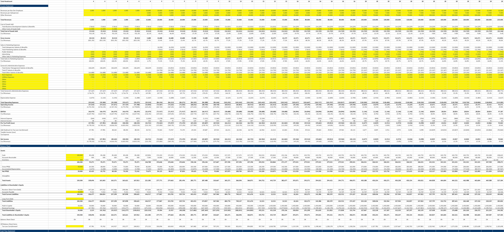
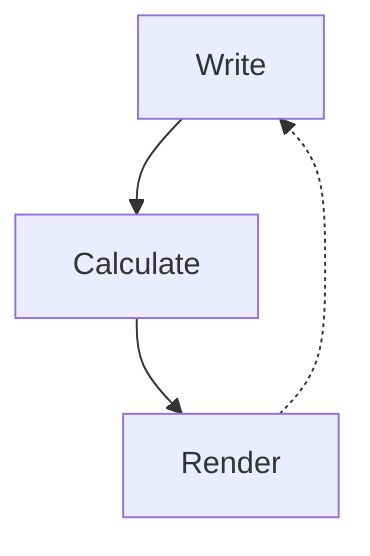

autoscale: true
slidenumbers: true
time-budget: 20
theme: Trust 1A

# Teaching Coding Agents<br/>to Master _Spreadsheets_

### Nuno Campos

#### Witan Labs, CTO & Co-Founder

#### Previously LangChain, LangGraph

#### AIE London — April 2026

^ Duration: 20 minutes. Slides + code examples.

---

## 50% -\> 92%

- 4 months, multiple architectures, and many dead ends
- What mattered most: replacing 15 discrete tools with one REPL

^ This is about getting coding agents to become as good at spreadsheets as they are at Python or JS. We started at 50% accuracy on a financial analysis benchmark and got to 92%. I'll chat about what actually moved the needle and what didn't. The agent kept wanting to write code. Once we let it, the results followed.

---

## The problem



**A human sees:** revenue table, assumptions, P&L summary

**An LLM sees:** 10,000 cell values, `=SUMPRODUCT((B$3:B$50="NEW")*(G$3:G$50))`, formatting metadata

^ Spreadsheets are deceptively hard for AI. A human glances at a financial model and instantly sees structure -- there's a revenue table here, assumptions in that yellow corner, a chart summarizing the P&L.

^ They know the column labeled "Q4" is a time period, parentheses mean negative numbers, the cell labeled "EBITDA" is derived from the ones above it.

^ An LLM sees none of this. Ask it "what's the revenue?" and it has to figure out: which revenue? There might be gross revenue, net revenue, revenue by department, revenue by quarter -- dozens of cells labeled "revenue" across multiple sheets.

^ Which time period? Which business unit? Is the number it found an input or a formula? The spatial and semantic disambiguation that a human does at a glance is the hard part.

---

## One dead end

**Three specialized agents:**

1. Block discovery — identifies workbook structure
2. Edit agent — 5-step process: disambiguate, define end state, plan, execute, verify
3. Question agent — answers questions

**Key finding:** Rigid architectures don't win

^ One thing we tried at the beginning was to split the work into three agents.

^ The important one was the edit agent's five-step reasoning process: disambiguate the request, define the desired end state, plan the implementation, execute, verify.

^ This changed the kind of errors we got. Without it, the agent made irreversible mistakes mid-execution.

^ With it, most errors surfaced during planning, where it’s cheaper to fix them. This worked better than giving the agent better tools, more context, or a stronger model.

^ But the architecture was rigid. Discovery ran once upfront and couldn't be revisited. The three-agent pipeline meant context couldn't flow between stages.

---

## More dead ends

| Representation | Why it failed                               |
| -------------- | ------------------------------------------- |
| TSV views      | Lost formatting and structural context      |
| SQL views      | Flat tables didn't capture visual structure |
| HTML tables    | Too verbose, consumed too many tokens       |
| DOT graphs     | Useful for analysis, not for interaction    |
| XML/XSLT       | LLM struggled with the syntax               |

None of them worked as a general-purpose representation — but two informed what came next.

^ We spent some weeks weeks trying what i think is probably every possible way to represent a spreadsheet to an LLM. None worked as a standalone representation, but two turned out to be useful as methods inside the REPL. They all had something going for them in theory,

^ eg xml is how excel files are actually represented on disk,

^ sql has been around for decades (ie so much representation in llm training data) as the canonical way to deal with two dimensional data

^ graphviz dot graphs would expose the dependencies between the formulas, etc.

^ but what matters is what actually works in practice, and none really did

^ They all informed what came after, but worth highlighint two of them

^ TSV/CSV is compact and communicates surrounding context in few tokens. It works especially well when each cell includes its address — off-by-one counting mistakes are common otherwise — and when formulas are included alongside values. This became `readRangeTsv`, one of the most-used API operations.

^ HTML was a step in the right direction for when layout, formatting, and whitespace matter — but only when rendered to an image. We ended up writing a rendering engine that previews any range to PNG. That became the visual verification step in the feedback loop.

---

## November 23rd: The REPL

We replaced all 15 tools with a persistent Node.js REPL and a spreadsheet API.

```
Agent Loop --(JavaScript code)--> Node.js REPL --(JSON-RPC)--> Spreadsheet engine
                                      |                            |
                                  Variables persist          Workbook state
                                  across calls               persists
```

^ On November 23rd, we replaced all 15 tools with one: a persistent REPL with access to a spreadsheet API -- about 50 operations for reading, searching, tracing formulas, and writing. Instead of "read this cell", "search for this label", "write this value" as separate tools, the agent writes JavaScript. Variables persist across calls. <!--90-second timeout per execution, 5MB output limit, sandboxed with no write/network/subprocess access.-->

^ Why JS? We needed a scripting language that is easy to sandbox, and LLMs are super familiar with. Python would probably work equally well

^ The actual implementation of the methods was separate from this, it was in C# as there's more tooling there to deal with xlsx files

---

## Before vs. After

**Before** (10-15 tool calls):

```
Tool call 1: list_sheets()           -> ["Summary", "Data", "Inputs"]
Tool call 2: read_range("Summary!A1:D10") -> cell values
Tool call 3: find_cells("Revenue")   -> [matches]
Tool call 4: read_cell("Summary!C10") -> "$1,234,567"
...
```

**After** (1 tool call):

```javascript
const sheets = await xlsx.listSheets(wb);
const summary = await xlsx.readRangeTsv(wb, `${sheets[0].name}!A1:D10`);
const revenue = await xlsx.findCells(wb, "Revenue", { context: 1 });
console.log(sheets, summary, revenue);
```

^ This is what it looked like before and after.

^ Before: exploring a workbook took 10 to 15 tool calls. Each one is an LLM round-trip -- the model decides what to do, formats the tool call, waits for a result, interprets it, decides the next step.

^ After: the same exploration in one call. Three operations, all results visible together. But it goes further than just batching.

---

## Code mode vs. REPL

**Code mode** — the agent writes scripts instead of making tool calls. Operations compose naturally. 50-line scripts are common.

**REPL = code mode + persistent state** — variables survive across calls. The agent writes shorter scripts, reasons between them, builds understanding incrementally.

```javascript
// Code mode: one long script, print everything at the end
// REPL: explore, reason, continue
const revenue = await xlsx.findCells(wb, "Revenue", { context: 1 });
console.log(revenue);
// → agent reasons about the output, then writes the next script
```

**Result:** accuracy gain on harder tasks — the agent can course-correct mid-exploration.

^ Some of you will be familiar with code mode, repl is one step further.

^ Code mode is gaining more adoption, because it is already a big improvement over discrete tools. The agent writes a complete script -- find the sheets, read a range, search for a label, print the results -- all in one call. 50+ line scripts are common. But everything has to be planned upfront.

^ Persistent state changes the agent's behavior. It writes shorter scripts, printing fewer items each time, and interleaves reasoning with execution. It can look at output, think about what to explore next, and continue from where it left off.

^ On harder tasks -- multi-sheet analysis, ambiguous labels -- this led to a consistent accuracy improvement. There's also a latency gain: the workbook stays open across calls, so the agent isn't paying the cost of reopening and reparsing and saving the file on every invocation.

^ Two more reasons the REPL worked:

^ flexible exploration -- conditionals, loops, error recovery within a single call, which discrete tools can't do. And API evolution -- adding new methods such as traceToInputs and traceToOutputs from months of formula analysis work was just adding two functions.

^ No tool schema changes, no registration. The entire API surface ships as a single skill the agent reads at the start of a session. And explaining the api to the agent is as simple as stuffing a typescript type definitions file in the prompt

---

## The results

| Date   | Pass rate | Tasks |
| ------ | --------- | ----- |
| Nov 30 | **74%**   | 104   |
| Dec 11 | **88%**   | 167   |
| Dec 14 | **92.1%** | 165   |

Zero timeouts. 50-second average runtime.

18 points in two weeks from compounding gains:
better search, new API methods, improved docs, backend bug fixes

^ No single change after the REPL was dramatic on its own. Better fuzzy search, formula tracing functions, improved system prompt documentation, backend bug fixes. But each one removed a class of failures, and the effects compounded -- 18 points in two weeks.

^ The zero-timeout number matters. Before the REPL, timeouts were a significant failure mode. After it, every task completed within budget.

---

## The verification loop

[.column]

The formula engine and renderer close a loop the agent uses to check its own work.

This held across three successive frontier model releases. Each new model used the same loop more effectively.

[.column]



^ There's a lot of parallels with coding. Your claude code or codex does a much better job when it can run the compiler, linter, tests and iterate based on those results. As indeed us humans do as well.

^ The same for spreadsheets:

^ The formula engine and visual renderer close a feedback loop. The agent writes to a cell, the engine recalculates all dependents, it checks for formula errors, and renders a region to PNG to verify the result visually.

^ The formula engine and the rendering engine are the source of truth -- the verification loop makes it natural to use it rather than attempting arithmetic in code.

^ This only works if the engine is high-fidelity. An incomplete formula engine as feedback makes output worse -- the agent reasons over incorrect intermediate results and compounds the errors. The verification loop is only as good as the engines that power it.

---

## Interface vs. engines

The **REPL** is an interface — the best one today, because coding is where models are strongest.

The **engines** — formula calculation, rendering, linting — are the more durable part. They're what close the verification loop, and they compound with each new model.

If for instance agents become as capable at computer use as they are at coding, the interface might change. The engines won't.

^ The REPL works today because coding is the dominant model capability. But the jagged frontier of capability keeps moving. If computer use catches up — if agents can interact with a spreadsheet visually as effectively as they can write code against an API — then the best interface might look very different.

^ What won't change is the need for high-fidelity formula calculation, rendering, and linting. These are what let the agent verify its own work. They compound with model capability rather than being replaced by it.

---

## Domain knowledge outlived every tool

- We changed tools four times in four months
- The financial domain knowledge improved results on **every one of them**

Structured as a composable prompt component:

- How to interpret margins, profitability, revenue cascades
- Model type recognition (DCF, LBO, three-statement)
- Communication conventions ($1.2M not $1,234,567.89)
- "Never calculate in your head what the spreadsheet can calculate for you"

It was the most reused component in the system.

^ We changed tools four times -- the domain knowledge survived all of them. How to interpret margins, what "profitability" actually asks for, that revenue changes cascade through COGS and working capital. These improved results regardless of what tool the agent was using.

^ We structured it as a composable prompt component. The "Financial Expert Mindset" could be attached to any tool approach. It became a very portable piece of the system.

---

## Evaluation was half the work

We started with only LLM-as-judge. We couldn't tell if a score change was the agent improving or the evaluator being flaky.

We replaced it with deterministic comparison wherever possible — programmatic checks for values, layout, and formatting. LLM grading only for genuinely subjective text answers.

568 commits. Nearly as complex as the agent itself.

^ The principle: match your evaluation method to your output type. If the comparison is objective -- are these values correct, is this layout right, do these formulas produce the right outputs -- use programmatic comparison. It's reproducible and you can trust score changes. Reserve LLM grading for cases where the output is genuinely subjective.

^ The scale surprised us. 568 commits, about 29,000 lines of TypeScript. Building reliable evaluation was as much engineering effort as building the agent. But every significant improvement in the project traced back to a benchmark result. Without evaluation you can trust, you're guessing.

---

## Infrastructure bugs look like reasoning failures

| What it looked like        | What it actually was                          |
| -------------------------- | --------------------------------------------- |
| Agent can't find data      | One-character extraction bug (50% -\> 73%)    |
| Agent uses wrong quoting   | SKILL.md had backwards examples               |
| Agent times out constantly | Per-cell recalculation query instead of batch |
| Agent retries endlessly    | API returning empty results intermittently    |

**When the agent seems confused, check the plumbing first.**

^ This was a recurring theme throughout the project. Every time we thought the agent was confused or the model was failing, the actual problem was somewhere in the infrastructure.

^ A one-character bug that looked like model confusion. Documentation with backwards examples that the agent followed faithfully. A performance bug that looked like the agent being slow. An intermittent API failure that looked like the agent retrying for no reason.

---

[.build-lists: true]

## What generalizes

1. **Many small sequential tool calls = a bad scripting language.** Give the agent a real one.

2. **Build verification engines.** Formula calc, rendering, and linting close a feedback loop that compounds with model capability rather than being replaced by it.

3. **Interfaces are ephemeral, engines are durable.** The REPL works because coding is today's strongest model skill. That may or may not last.

4. **Structured reasoning \> better tools.** "Define the end state before you act" caught more errors than any tool improvement.

5. **Domain knowledge outlasts tools.** Four backends in four months. The domain knowledge improved results on all of them.

6. **Match evaluation to output type.** Deterministic comparison for objective outputs, LLM grading for subjective ones.

7. **Check the plumbing first.** Agent "confusion" is usually infrastructure.

^ One: if your agent is making many small sequential tool calls that compose into a larger operation, you've reinvented a bad scripting language. Give it a real one. This applies anywhere -- data analysis, code generation, system administration.

^ Two: the verification engines -- formula calculation, rendering, linting -- closed a feedback loop that held across three frontier model releases. Each new model used the same loop more effectively. The engines compound with capability.

^ Three: the REPL is the best interface today because coding is where models are strongest. But capability profiles shift. If computer use catches up to coding, different interfaces might work better. The engines underneath are the durable investment, and they need the best interface at each point in time to really shine.

^ Four: structured reasoning beats better tools. Making the agent define the end state before executing was super impactful.

^ Five: domain knowledge is the most portable asset. We went through four tool backends. The domain knowledge improved results on all of them and outlasted all of them.

^ Six: match your evaluation method to the output type. If the comparison is objective, use programmatic checks -- they're reproducible and you can trust score changes. Reserve LLM grading for genuinely subjective outputs.

^ Seven: when the agent seems confused, check the infrastructure before blaming the model. This came up over and over -- the extraction bug, the backwards documentation, the recalculation performance issue. The model was usually the last thing that was wrong.

---

witanlabs.com/agents
github.com/witanlabs/research-log
@nfcampos


^ We spent four months trying to make an LLM work with spreadsheets. We tried databases, specialized tools, multi-agent architectures, multiple representations. The breakthrough was giving up on constraining the agent and letting it program.

^ The REPL collapsed complexity, made the API trivially extensible, and eventually became the product itself. But the more durable insight was about the engines underneath -- formula calculation, rendering, linting. Those are what let each new model do better work on the same tasks.

^ Thank you.

<!--
Production notes:

Slide design:
- Dark background, large text, minimal words per slide
- Code examples should be syntax-highlighted
- Use the before/after comparison (slide 7) as the visual centrepiece
- The results table (slide 10), the verification loop (slide 11), interface vs engines (slide 12), and the CLI comparison (slide 14) are the "data" moments -- make them land
- Consider a simple line chart for the 50 -> 73 -> 74 -> 88 -> 92 trajectory

Pacing:
- Sections 1-3 (slides 1-5) set up the problem fast -- don't dwell
- Section 4 (slides 6-12) is the heart -- slow down here, let the code examples breathe
- Section 5 (slides 13-16) is the plot twist -- pause after "openpyxl won"
- Section 6 (slides 17-19) is rapid-fire lessons -- keep momentum
- Section 7 (slides 20-22) is the close -- land it and stop

Things to avoid:
- Don't oversell the 92% number -- acknowledge remaining failures and open problems
- Don't bash openpyxl -- it won fair and square, and the point is that simplicity has real value
- Don't make it a product pitch -- the story is about the engineering journey, the product is incidental
- Don't explain what a REPL is -- this audience knows

Potential audience questions (prep for hallway track):
- "How does the REPL handle security/sandboxing?" -- Node.js permission model: read-only fs to workspace, no writes, no net, no child processes. 90s timeout, 5MB output limit.
- "Does this work with Google Sheets?" -- In progress, architecture is designed to be engine-agnostic
- "What model?" -- Started GPT-5, ended Claude Opus 4.6. Domain knowledge improved results on both. Tested across Opus 4.6, GPT 5.4, Gemini 3.1 Pro on 256-task dataset -- witan tools gave +5-8pp accuracy (e.g. 77.9% vs 69.9% for Codex/GPT, 72.5% vs 67.2% for Claude Code) and ~15% lower latency vs no-tool baselines across all three model families.
- "How do you handle the 20K output truncation?" -- Agent learns to be selective about what it logs
- "What about the Rust formula work?" -- Didn't ship directly, but deeply informed the production API (traceToInputs, traceToOutputs, linting rules)
- "Why not LibreOffice for formula calculation?" -- Doesn't support LAMBDA/array formulas, corrupts OOXML on round-trip, fails silently in sandboxed environments. 9/10 benchmark tasks using openpyxl as primary tool failed.
- "How does the ephemeral write contract work?" -- Changes stay server-side by default; only persist with explicit --save flag. Failed edits don't corrupt workbooks.
-->
